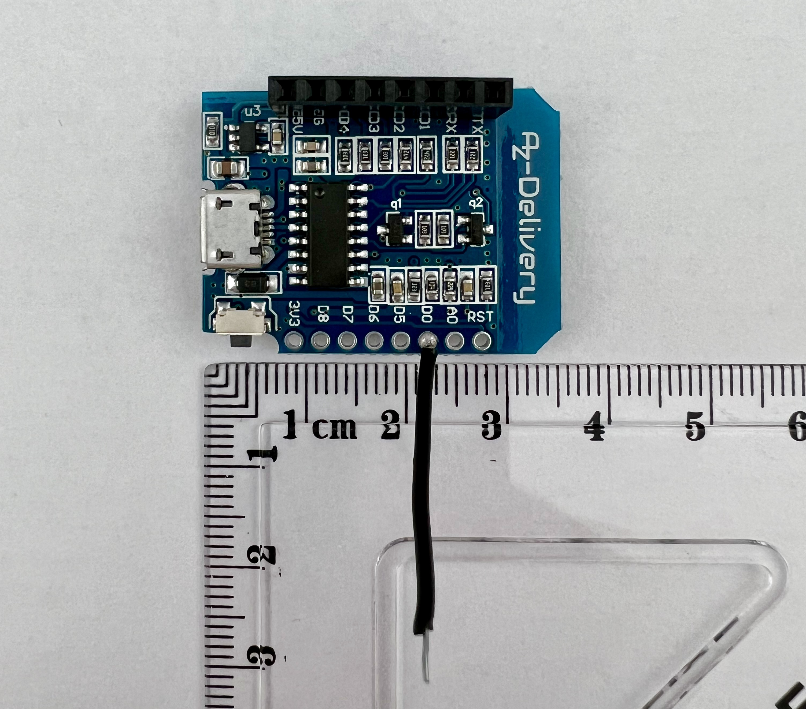
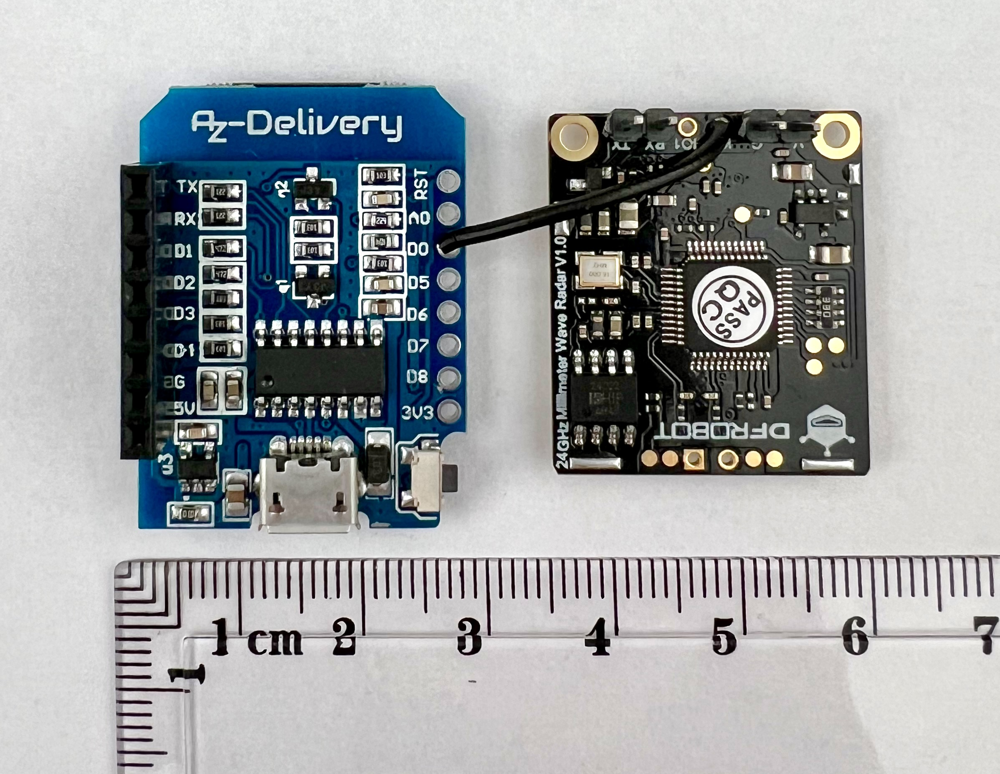
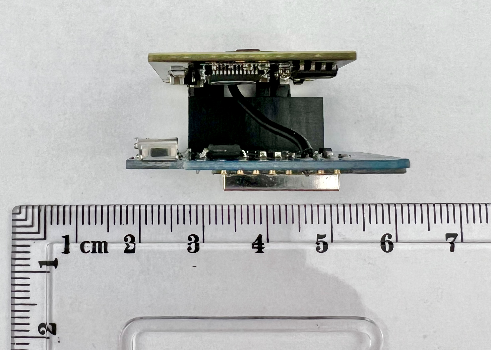
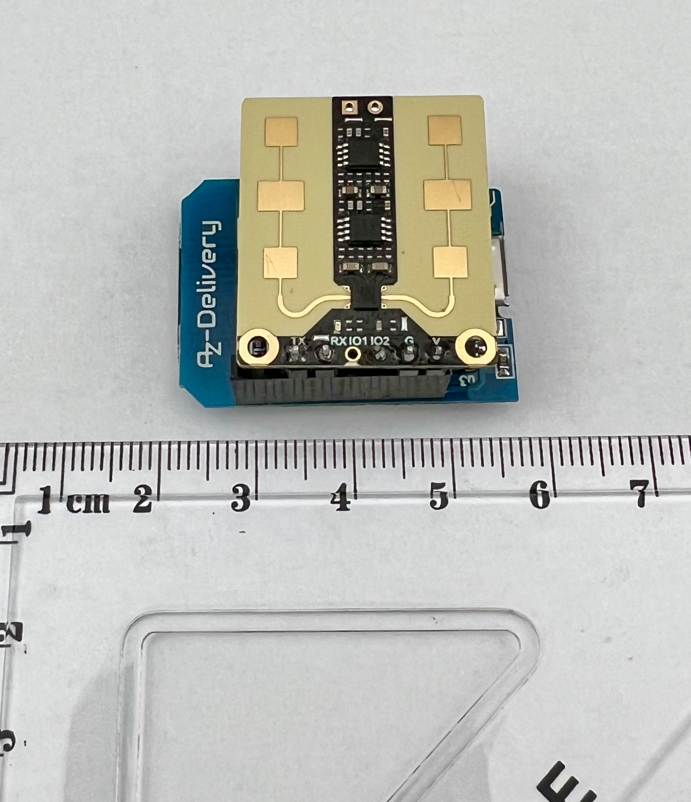
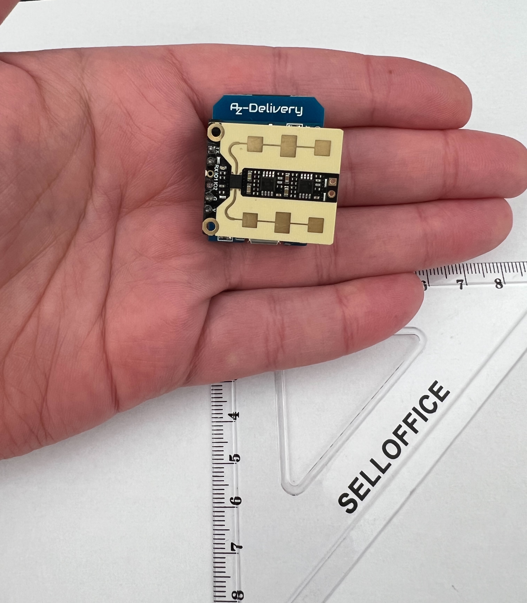
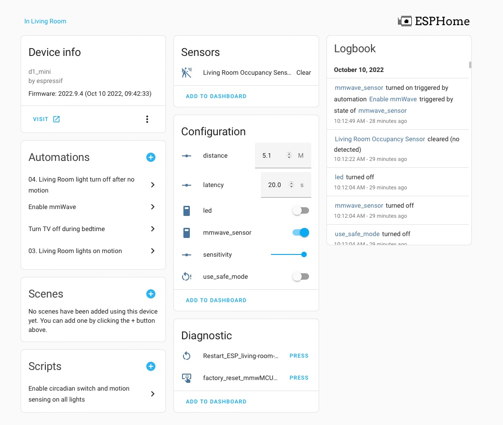

# Introduction
This is a step by step guide on how to build an mmWave presence detection using DFRobot SEN0395, D1 Mini ESP-8266 and ESPHome. 

The custom module in the code above is used to implement a room presense sensor and exposes the presense detection sensor and the radar's configuration variables to Home Assistant via the ESPHome integration.

This is based on the excellent work done by CRlogic in the HA forums and documented here: https://github.com/hjmcnew/esphome-hs2xx3a-custom-component/tree/release

In this fork the code is adapted to:
1. Deliver a very compact build as the DFRobot sensor is stacked on top of the D1 Mini
2. Trimmed down the code by CRLogic to improve stability for the low power D1 Mini
3. Prettify the exposed sensor names to Home Assistant to reflect the name of the room the sensor is in
4. Contain the full sensor yaml configuration to simplify the setup process

# Bill of Materials:
To make this DIY room presense sensor you'll need the below components:
1. D1 Mini (~£3)
2. DFRobot SEN0395 (from Digi Key, Mouser, Arrow.com, Farnell.com, AliExpress) (~£32)
3. Mini USB cable and a USB power supply (I use my old phone chargers) (~£5)
4. Soldering iron
5. 5 cm / 2 inch of wire
6. Optional: 3d printed case

Total Cost: £40

# Wiring instructions:
To get the smallest possible size we stack the sensor on top of the D1 Mini using the pins that come with the D1 mini. The wiring diagram below reflects a stacked configuration:
Sensor Pin -> D1 Mini Pin
1. TX -> D1
2. RX -> D2
3. IO1 -> not connected
4. IO2 -> D0 (using the wire)
5. G -> G
6. V -> 5V

For the D1, D2, G and 5V pins we will use header and pin connectors soldered on the D1 mini and the mmWave sensor. The D0 - IO2 connection happens via a wire which is soldered on the D0 pad of the D1 mini and the IO2 pad of the sensor.

# Assembly images

Solder the header connectors and the single wire to the D1 Mini as below:

Solder the pins to the outer two sets of pads on the sensor (TX, RX, G, V) and then solder the single wire to IO2

Plug in the sensor to the D1 mini,making sure the V sensor pin is aligned to the 5V header on the D1 mini

As you can see this is a super compact sensor, barely bigger than the D1 mini itself.

# Installing ESPHome and the mmWave code

1. Setup your esphome environment. For instructions: https://esphome.io
2. Clone this repository to your build environment. Download the code zip and unpack it in your esphome build directory
3. Open the sensor.yaml file and modify the following variables to match your setup:

**device_name**: the sensor's device name. This must be in lower case and any words separated with hyphens (-). For example: living-room-occupancy-sensor 
**device_name_pretty**: This is the name of the occupancy binary sensor that will be exposed to home assistant. It can be upper and lower case and can contain spaces. For example: Room Name Occupancy Sensor 
**ssid**: type your 2.4ghz wifi SSID 
**wifi_password**: type in your wifi password 

5. Do not modify the uart_tx_pin, uart_rx_pin, gpio_pin values unless you're using a different pinout connection.
4. Deploy the code. I have installed esphome on my mac so I use the following command to deploy the code: esphome run sensor.yaml

# Setting the sensor up in HomeAssistant and configuring its parameters
The sensor should be autodetected in your homeassistant dashboard. Go to Settings - Devices & Services and add the integration. Then you should be presented with the following device dashboard:

Here you can:
1. **See the occupancy sensor value (clear / detected)**. This is the sensor you will use in your automations. 
2. **Distance**: this variable can be used to set the maximum distance the sensor can see. It defaults to the sensor default value.
3. **Latency**: this is the sensor cool down period, i.e. how long should no presence be detected before the occupancy sensor is set to "Clear". It defaults to the sensor default value.
4. **Led**: a toggle switch to turn the sensor LED on or off. On initial setup it defaults to off but the sensor LED is on and blinking. So if you want to turn the sensor LED off, switch it on, wait for 10 seconds then switch it off again. The value should now persist in the sensor's memory
5. **mmwave_sensor**: This toggle switch turns the motion sensor (radar) on or off. It defaults to on, but is reported as off until the first time presense is detected. Can be usefull if you need to disable motion sensing from an automation or script.
6. **Sensitivity**: How sensitive the sensor is to movement. The Radar sensor is **very** sensitive to movement in order to deliver meaningfull presense detection but it can be triggered falsely with the movement of curtains, clothes etc. If you want to reduce sensitivity reduce this number. It defaults to 7, which is a good balance but if you are finding that the sensor reporting as clear when the room is occupied increase this to 9.
7. use_safe_mode: restarts the D1 mini in safe mode
8. **Restart**: restarts the sensor
9. **Factory reset mmWMCU**: resets the radar to its factory default settings. (distance, latency, led, sensitivity)

The sensor distance, latency, mmwave_sensor, sensitivity values are read from the radar's presistent memory. They persist reboots but reporting the values to HomeAssistant is delayed. It will take 5-10 minutes after you reboot the D1 Mini for the values to be reported so be patient until they are populated before making any changes.

Every time you change a value you need to wait ~15 - 20 seconds for the value to be written to the DFRobot radar sensor memory and for the radar to restart. While the D1 mini is writing the values to the radar's memory you'll see the LED light turn red. Once it starts blinking or is off (depending on your settings) the values are now written in memory and are persistent through reboots. 
